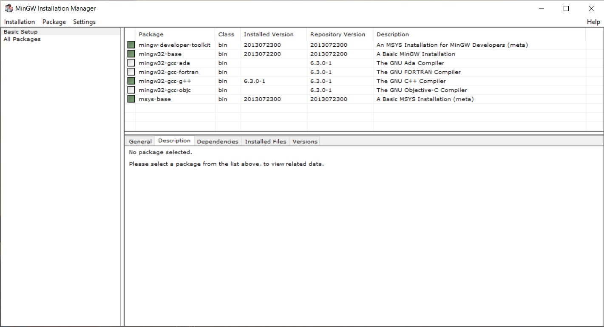
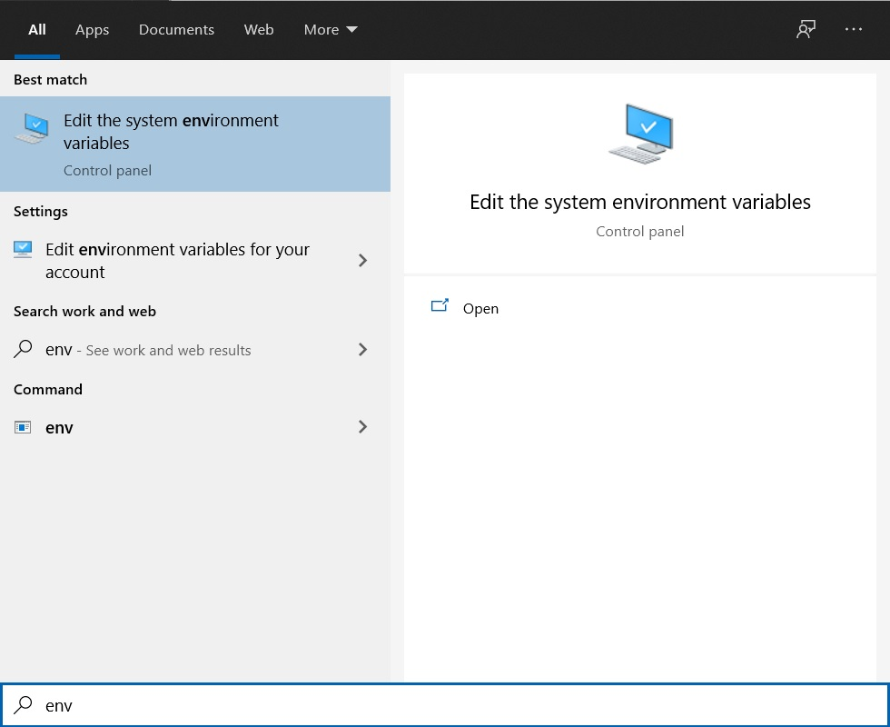
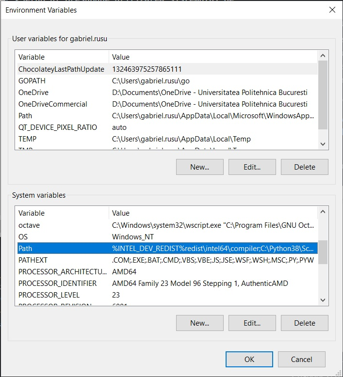
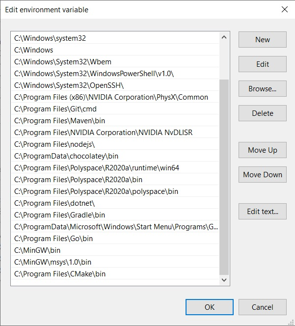

<h1 align="center">Student-Setup</h1>
<h3 align="center">Setup-ul presupune utilizarea sistemului de operare Windows</h3>

Pentru a putea rula si rezolva laboratoarele de la SDA este obligatorie instalarea urmatoarelor programe si urmarea instructiunilor ce se regasesc in acest README.md. Orice neclaritati in urmarea pasilor pot fi prezentate pe forumul Student-Setup de pe moodle.

Programele necesare sunt:
 - [MinGW](https://sourceforge.net/projects/mingw/) - set de programe ce emuleaza ecosistemul Linux pe Windows
 - [VS Code](https://code.visualstudio.com/) - editor de cod recomandat ce permite folosirea unor extensii utile in dezvoltarea software

 Dupa instalarea MinGW se vor selecta urmatoarele pachete din interfata grafica a programului:
 
In urma alegerii pachetelor expuse se va apasa butonul Instalation -> Apply Changes si se va astepta instalarea acestora.

Dupa instalare, se vor edita variabilele de sistem (environment variables) si se vor adauga path-urile catre fiserele bin ale minGW (Pentru a accesa optiunea trebuie sa scrieti in meniul de start al Windows-ului 'env' si sa selecati optiunea de mai jos. Accesarea meniului de start Windows se face prin apasarea pe butonul cu simbolul windows de la tastatura).

Daca instalarea s-a facut fara a modifica path-ul propus de installer, atunci urmatoarele path-uri sunt cele dorite:

``` 
C:\MinGW\bin
C:\MinGW\msys\1.0\bin
```


Path-urile de mai sus vor fi introduse in variabila de sistem Path prin selectarea variabilei Path si apasarea pe butonul Edit.


Pentru a testa ca procesul a reusit, scrieti in terminalul windows cmd comanda ```g++```; daca obtineti un mesaj similar cu cel de jos, inseamna ca Windows-ul a reusit sa gaseasca programul ```g++``` dar ca nu a primit un fiiser pe care sa il compileze :

``` 
C:\Users\gabriel.rusu\Desktop\student-setup>g++
g++: fatal error: no input files
compilation terminated.
```
## Indicatii rezolvare laborator:
1. **Citirea/Afisarea se face din/in fisier.**
2. Pentru fiecare cerinta se implementeaza functiile din fisierele **.c** din folderul **src**.
3. Pentru verificarea locala este indicat sa apelati in **main.c** (din **src**) functiile pe care le-ati implementat si vreti sa le testati.
4. Fiecare functie pe care trebuie sa o implementati este descrisa in fisierele **.c** sub forma de comentariu. (Exemplu: //TODO: Implementeaza functia ,,sortare" + descriere parametri + hint-uri)
5. Nu modificati codul predefinit, aveti permisiunea de a modifica codul doar cand acest lucru va fi specificat.
6. Dupa ce ati terminat de implementat o functie, se recomanda stergerea comentariului **TODO**.
7. Se face **exceptie** de la indicatia **punctului 6** doar in cazul in care comentariul **TODO** apare in interiorul unei functii. In acest caz trebuie sa completati cu raspunsul vostru in interiorul acelui comentariu.<br>
***Exemplu:*** _/*TODO: Care este complexitatea metodei folosite? Raspuns: O(n^3) deoarece ..._*/


## FAQ:

### La ce ma ajuta acest setup ?

Acest setup are rolul de a va ajuta sa rulati testele unitare aferente fiecarui schelet de laborator.

### Ce este schelet-ul de laborator ?

In fiecare saptamana veti primi un nou schelet de laborator ce are ca scop introducerea studentilor in notiunile predate la curs intr-un mod practic.

Se numeste schelet de laborator deoarece voi va trebui sa completati logica functiilor descrise in schelet fara sa scrieti un program functional de la 0 in fiecare saptamana.

### Ce sunt testele unitare ?

Testele unitare sunt un set de teste ce au rolul de a apela functiile scrise de voi si de a determina daca acestea ruleaza corect.

In cazul in care s-a implementat ceva gresit, testul va semnaliza acest lucru in consola

### Cum rulez scheletul ?

Odata descarcat scheletul laboratorului din saptamana respectiva, deschideti un terminal in folder-ul sheletului de laborator si rulati comanda de mai jos pentru a testa programul

``` 
make test
```

### Ce incarc pe moodle ?

Pe Moodle va trebuii incarcat doar folder-ul __src__ ce contine tot codul sursa la care ati lucrat.

Se recomanda trimiterea folderului intr-o arhiva .rar/.zip
